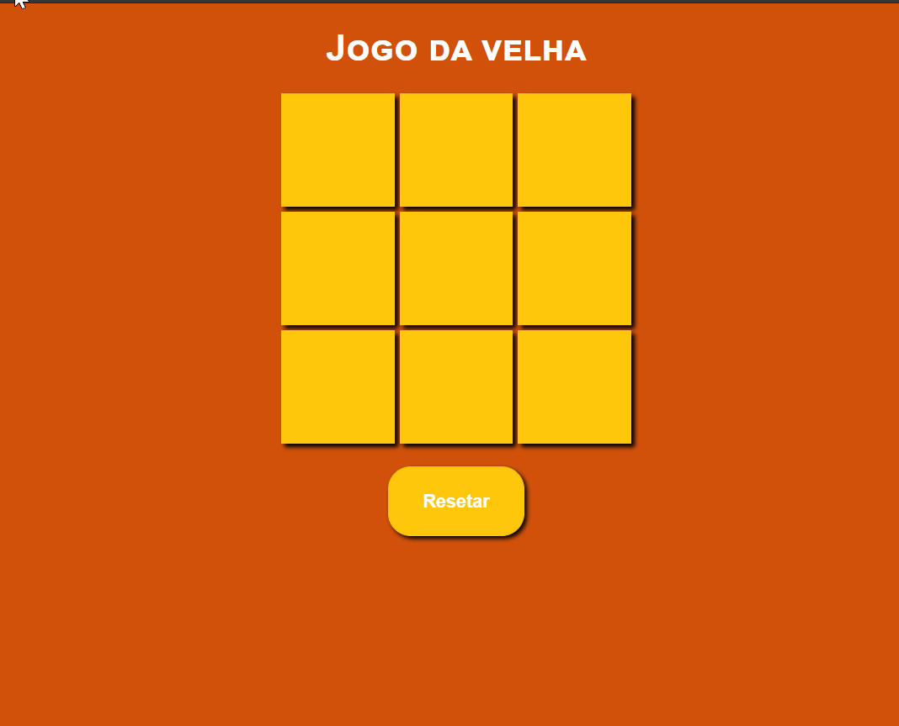

# Jogo da velha

### - Neste desafio foi proposta realizar um jogo da velha. Porém o legal desde projeto foi que utilizei o conceito de MVC (Model-View-Controller), no projeto há um arquivo game.js onde possui as regras do jogo (regras de negócio) e neste arquivo não há nada vinculado com HTML ou CSS. Também existe outro arquivo chamado interface.js, e é este arquivo que é o controlador, que faz o meio de campo entre o regra de negócio (game.js) e a view que é a interface  (HTML CSS). 

### - Nesta aplicação foram usados as seguintes tecnologias:

#### *HTML.
#### *CSS.
#### *JavaScript

### Front End

### Veja o projeto você mesmo! Acesse: https://jogodavelhaa.netlify.app/
### Gostou do meu projeto? :D Entre em contato comigo! 
[Linkedin](https://www.linkedin.com/in/lucas-rosa-058683102/)  
[Email: lucasmetron@gmail.com](mailto:lucasmetron@gmail.com)
